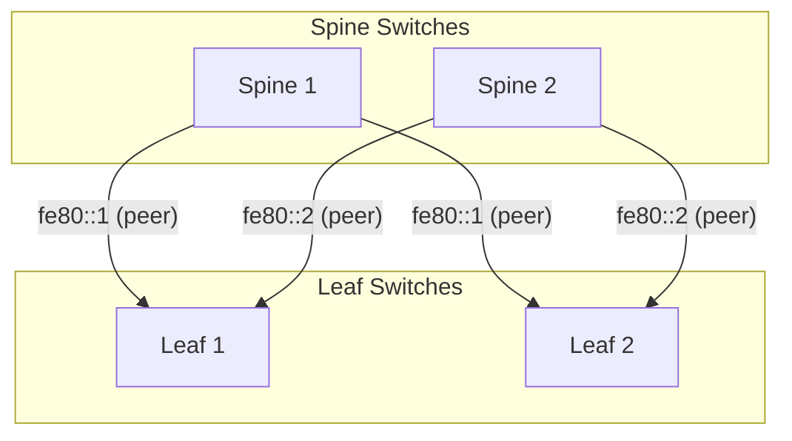

# Spine-Leaf Underlay (IPv6 Link-Local)

Modern data centers use a *spine-leaf* topology for predictable, scalable L3 networking. Every leaf switch connects to each spine, ensuring at most one hop between any server. This fabric is purely Layer-3: no spanning tree, no VLANs across the fabric – just IP routing.

Spine-leaf fabrics enable **massive scale-out**. As you add racks (leaves) or increase core capacity (spines), Equal-Cost Multi-Path (ECMP) routing spreads traffic across all links. If a link or node fails, traffic reroutes over alternate paths within tens of milliseconds (with BFD assisting rapid detection).

## IPv6 Link-Local BGP Sessions

In our design, we run BGP between spines and leaves over IPv6 *link-local* addresses. Link-local addresses (fe80::/10) are unique per link and require no global IP allocation. By peering BGP using these addresses, we keep configuration minimal and avoid managing numerous IP subnets for fabric links. Each router uses its interface's link-local address to establish BGP neighbors – this is known as **BGP Unnumbered**, allowing IPv4 or IPv6 prefixes to be advertised with an IPv6 next-hop (per RFC 5549) [oai_citation:0‡blog.ipspace.net](https://blog.ipspace.net/2022/11/bgp-unnumbered-duct-tape/#:~:text=We%20know%20that%20unnumbered%20BGP,now%20RFC%208950). The result: simpler config and no wasted IP space.

Each EBGP session is bound to an interface rather than an IP. In FRRouting (FRR), the configuration uses the interface name in place of neighbor IP (e.g. neighbor swp1 interface remote-as 65002). We’ll explore this configuration in the lab.

:::note
Layer-3 vs. Layer-2: A "pure L3" fabric routes packets using IP addresses (Layer 3 of OSI), as opposed to switching frames by MAC (Layer 2). Eliminating Layer-2 domains in the core network improves stability and makes failover behavior more deterministic.
:::

With the physical topology and addressing covered, you’re ready to see how unnumbered BGP and BFD deliver fast convergence. Next, we’ll detail unnumbered BGP setup and the sub-50ms failover mechanics.

