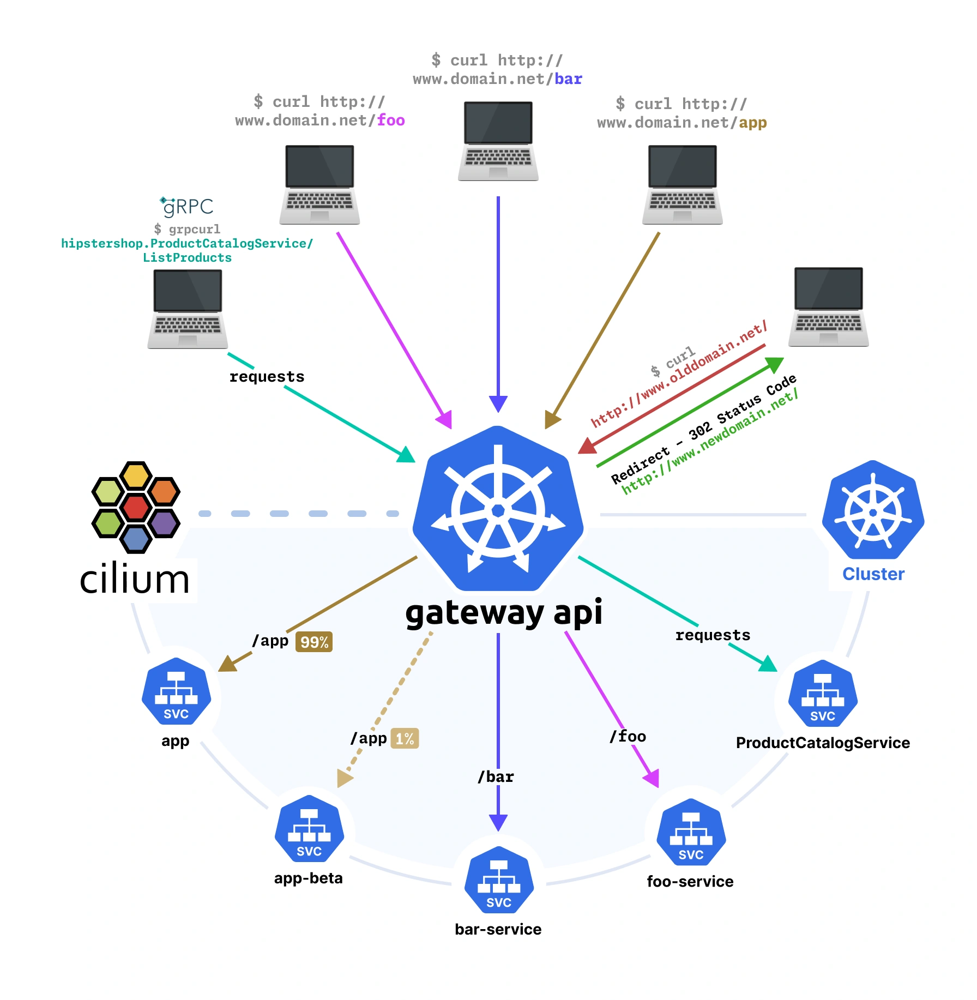

Load balance, routing, and controlling HTTP(S) traffic as it enters our network (cluster) is achieved with Gateway API.

Gateway API capabilities:
- HTTP routing
- HTTP traffic splitting and load-balancing
- HTTP request and response header rewrite
- HTTP redirect and path rewrites
- HTTP mirroring
- Cross-namespace routing
- TLS termination and passthrough
- gRPC routing

---

## Advertising Routes

### Border Gateway Protocol (BGP)
Cilium can advertise the LoadBalancer Service IPs or the PodCIDR ranges to the rest of the network.

| Feature                     | LoadBalancer IPs                            | PodCIDRs                                 |
|----------------------------|---------------------------------------------|-------------------------------------------|
| **Traffic Type**           | External (to Services)                      | Internal (to Pods)                        |
| **Common Use Case**        | Bare metal LoadBalancer routing             | Direct pod communication / routing        |
| **Granularity**            | Per-Service                                 | Per-Node                                  |
| **Requires local endpoint?** | Yes (if `ExternalTrafficPolicy=Local`)    | No                                        |
| **Configuration Flag**     | `bgp-announce-lb-ip`                        | BGP speaker config with PodCIDR range     |

“Requires local endpoint?” means the BGP speaker will only announce the LoadBalancer IP if it actually has a pod backing the service on that node — this is controlled by `externalTrafficPolicy: Local`.

Once the peering session is established and routes are advertised/exchanged, the rest of the network and access applications hosted in the Kubernetes cluster.

The Cilium CLI command `cilium bgp peers` can be used to verify peering sessions have been established and routes are being advertised.

Better suited for data center networks

### Address Resolution Protocol (ARP)
When the client is on the same network as the Kubernetes LoadBalancer Service, BGP is not necessary.
Better suited for homelabs.