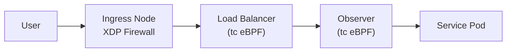

# Network Diagrams

Below are key network diagrams (in Mermaid markdown format) used throughout the course:

- **Spine-Leaf Fabric:** [fabric_topology.mmd](/diagrams/fabric_topology.mmd) – Mermaid diagram showing a two-spine, two-leaf topology.
- **Talos Cluster Integration:** [talos_cluster.mmd](/diagrams/talos_cluster.mmd) – Mermaid diagram illustrating Talos control plane and worker connected to a leaf switch.
- **Service Chain Example:** [service_chain.mmd](/diagrams/service_chain.mmd) – Mermaid diagram of a sample service chain with an ingress firewall, load balancer, and observer function.

You can open these `.mmd` files in a Mermaid editor or VSCode to view and modify the diagrams.

For quick reference, here's the Mermaid source of the service chain diagram:

Feel free to adapt these diagrams for your own network documentation. Visualizing the architecture is crucial for understanding and explaining packet flow.